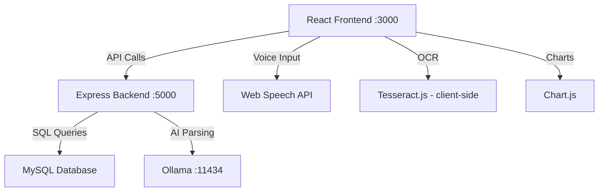

# Expense Tracker Application — Implementation Plan

A full-stack expense tracker with voice input (Web Speech API), OCR receipt scanning (Tesseract.js), AI-powered expense parsing (Ollama), and interactive visualizations (Chart.js).

## User Review Required

> [!IMPORTANT]
> **MySQL Credentials**: The plan assumes MySQL is running locally on port 3306 with user `root` and password `password`. Please confirm your MySQL credentials and database name preference.

> [!IMPORTANT]
> **Ollama**: The plan assumes Ollama is installed and running locally on port 11434 with a model like `llama3` or `mistral`. Please confirm which model you have available.

> [!WARNING]
> **Web Speech API**: Only works in Chromium-based browsers (Chrome, Edge). Firefox/Safari have limited or no support.

## Open Questions

1. **MySQL credentials** — What are your MySQL host, port, username, and password?
2. **Ollama model** — Which Ollama model do you have installed? (e.g., `llama3`, `mistral`, `phi3`)
3. **Port preferences** — Backend on port 5000, frontend dev server on port 3000 — acceptable?

---

## Architecture Overview



**Key design decisions:**
- **Tesseract.js runs client-side** to avoid heavy server-side processing
- **Session-based auth** using `express-session` with MySQL session store
- **Ollama calls from backend** to keep the AI prompt logic server-side
- **React with Vite** for fast development experience
- **bcrypt** for password hashing

---

## Proposed Changes

### Database Layer

#### [NEW] `backend/db/schema.sql`
MySQL schema with two tables:
- `users` — id, username, email, password_hash, created_at
- `expenses` — id, user_id (FK), amount, category, date, source (enum: voice/ocr/manual), description, created_at

#### [NEW] `backend/db/connection.js`
MySQL connection pool using `mysql2/promise`

---

### Backend — Express Server

#### [NEW] `backend/package.json`
Dependencies: express, mysql2, express-session, express-mysql-session, bcrypt, cors, dotenv, axios

#### [NEW] `backend/.env`
Environment variables: DB_HOST, DB_USER, DB_PASSWORD, DB_NAME, OLLAMA_URL, SESSION_SECRET, PORT

#### [NEW] `backend/server.js`
- Express app setup with CORS, JSON parsing, session middleware
- Route mounting
- Server startup with DB connection test

#### [NEW] `backend/routes/auth.js`
- `POST /api/auth/register` — Register new user (hash password with bcrypt)
- `POST /api/auth/login` — Login (verify password, create session)
- `POST /api/auth/logout` — Destroy session
- `GET /api/auth/me` — Check current session

#### [NEW] `backend/routes/expenses.js`
- `GET /api/expenses` — List user's expenses (with optional date filtering)
- `POST /api/expenses` — Create new expense
- `DELETE /api/expenses/:id` — Delete an expense
- `GET /api/expenses/summary` — Aggregated data for charts (category totals, monthly totals)
- `GET /api/expenses/export` — Export as CSV

#### [NEW] `backend/routes/ai.js`
- `POST /api/ai/parse` — Send text to Ollama with few-shot prompt, return structured JSON
- Uses the exact prompt template from requirements
- Validates Ollama response is proper JSON with amount + category

#### [NEW] `backend/middleware/auth.js`
- Session-based authentication middleware to protect routes

---

### Frontend — React (Vite)

#### [NEW] `frontend/` (via `npx create-vite`)
Vite + React project scaffold

#### [NEW] `frontend/src/index.css`
- Complete design system: CSS custom properties, dark theme, glassmorphism cards
- Responsive layout utilities
- Button styles, form styles, animations
- Premium color palette with gradients

#### [NEW] `frontend/src/App.jsx`
- React Router setup with protected routes
- Auth context provider
- Routes: `/login`, `/register`, `/dashboard`

#### [NEW] `frontend/src/context/AuthContext.jsx`
- Auth state management (user, loading)
- Login/logout/register functions
- Session persistence check on mount

#### [NEW] `frontend/src/pages/LoginPage.jsx`
- Login form with email/password
- Link to register
- Animated, premium design with glassmorphism

#### [NEW] `frontend/src/pages/RegisterPage.jsx`
- Registration form
- Password confirmation
- Redirect to dashboard on success

#### [NEW] `frontend/src/pages/Dashboard.jsx`
- Main dashboard layout with sections:
  - Voice input controls + real-time transcription display
  - OCR upload area
  - Manual expense entry form
  - Expense list table
  - Charts section (pie + bar)

#### [NEW] `frontend/src/components/VoiceInput.jsx`
- Web Speech API integration with `continuous = true`
- Custom 2-second silence detection timer
- Start/Stop toggle button
- Real-time transcription display
- Auto-sends to backend AI parser after silence
- Auto-restarts listening after processing

#### [NEW] `frontend/src/components/OCRUpload.jsx`
- File upload with drag-and-drop
- Client-side Tesseract.js processing with progress indicator
- Sends extracted text to backend AI parser
- Shows extracted text and parsed result

#### [NEW] `frontend/src/components/ManualEntry.jsx`
- Form with amount, category (dropdown), date, description
- Quick-add functionality

#### [NEW] `frontend/src/components/ExpenseList.jsx`
- Table/list of expenses with date, amount, category, source badges
- Delete functionality
- Source indicators (🎤 voice, 📷 OCR, ✏️ manual)

#### [NEW] `frontend/src/components/Charts.jsx`
- Pie chart: category-wise expense breakdown
- Bar chart: monthly expense totals
- Uses Chart.js via react-chartjs-2
- Responsive and themed to match UI

#### [NEW] `frontend/src/components/CSVExport.jsx`
- Button to download expenses as CSV

#### [NEW] `frontend/src/api/index.js`
- Axios instance with base URL and credentials
- API functions for all endpoints

---

## File Tree (Final)

```
c:\Users\MUSKAN\new\
├── backend/
│   ├── .env
│   ├── package.json
│   ├── server.js
│   ├── db/
│   │   ├── schema.sql
│   │   └── connection.js
│   ├── middleware/
│   │   └── auth.js
│   └── routes/
│       ├── auth.js
│       ├── expenses.js
│       └── ai.js
└── frontend/
    ├── package.json
    ├── vite.config.js
    ├── index.html
    └── src/
        ├── main.jsx
        ├── App.jsx
        ├── index.css
        ├── api/
        │   └── index.js
        ├── context/
        │   └── AuthContext.jsx
        ├── pages/
        │   ├── LoginPage.jsx
        │   ├── RegisterPage.jsx
        │   └── Dashboard.jsx
        └── components/
            ├── VoiceInput.jsx
            ├── OCRUpload.jsx
            ├── ManualEntry.jsx
            ├── ExpenseList.jsx
            ├── Charts.jsx
            └── CSVExport.jsx
```

---

## Verification Plan

### Automated Tests
1. `cd backend && npm install` — Verify dependencies install
2. `cd frontend && npm install` — Verify dependencies install
3. Run MySQL schema to create tables
4. Start backend server — verify it connects to MySQL and listens on port
5. `cd frontend && npm run dev` — Verify React dev server starts

### Manual Verification (Browser)
1. Open frontend in Chrome
2. Register a new user → verify redirect to dashboard
3. Login/logout flow
4. Add manual expense → verify it appears in list and charts
5. Use voice input → verify transcription, AI parsing, and auto-save
6. Upload a receipt image → verify OCR extraction and parsing
7. Verify pie chart and bar chart render correctly
8. Export CSV and verify contents
9. Refresh page → verify session persists
